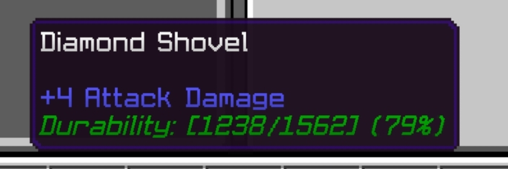

# ItemDurability Plugin

<p align="center">
  
</p>

[](https://opensource.org/licenses/MIT)
[](https://github.com/pmmp/PocketMine-MP)

## Description

**ItemDurability** is a high-performance PocketMine-MP plugin that displays item durability information in real-time within the item's lore (description). This plugin helps players see the remaining durability of weapons, tools, and armor, allowing them to know when to repair or replace them before they break.

## Preview



### Example Durability Color System

In-game, the durability text will automatically change colors based on the item's condition:

| Color | Sample | Durability Example | Condition |
|-------|--------|-------------------|-----------|
|  | Green | **Durability: [180/200] (90%)** | Very Good Condition |
|  | Dark Green | **Durability: [140/200] (70%)** | Good Condition |
|  | Yellow | **Durability: [100/200] (50%)** | Medium Condition |
|  | Gold | **Durability: [60/200] (30%)** | Low Condition |
|  | Red | **Durability: [30/200] (15%)** | Very Low Condition |
|  | Dark Red | **Durability: [10/200] (5%)** | Critical Condition |

## Features

### Core Features
- ✅ **Real-time Durability Display**: Shows durability in customizable format within item lore
- ✅ **Automatic Color Gradation**: Color changes based on condition (Green → Red scale)
- ✅ **Universal Compatibility**: Supports all PocketMine-MP items with durability
- ✅ **Smart Update System**: Only updates when necessary to prevent spam
- ✅ **No Duplicate Lore**: Automatically removes old durability lines
- ✅ **Low Durability Warnings**: Configurable alerts for items needing attention

### Performance Optimizations
- 🚀 **Batch Processing**: Efficient batch update system for large servers
- 🚀 **Smart Throttling**: Per-player throttling prevents unnecessary updates
- 🚀 **Memory Management**: Automatic cleanup of offline player data
- 🚀 **Configurable Performance**: Tunable settings for different server sizes
- 🚀 **Exception Handling**: Robust error handling prevents crashes

### Advanced Features
- ⚙️ **Comprehensive Config Validation**: Automatic validation and correction of settings
- ⚙️ **Flexible Format System**: Support for current, max, and percentage placeholders
- ⚙️ **Plugin Compatibility**: Works seamlessly with enchantment and repair plugins
- ⚙️ **Server Scalability**: Optimized for servers from 1 to 1000+ players

## Installation

1. Download the latest version from [GitHub Releases](https://github.com/ImmoDevs/ItemDurability/releases)
2. Place the `.phar` file in the `plugins` folder of your PocketMine-MP server
3. Restart the server
4. Edit the configuration file in `plugins/ItemDurability/config.yml` as needed

## Configuration

```yaml
# ItemDurability Configuration

# Durability display format
# %current% = current durability
# %max% = maximum durability
# %percent% = durability percentage
durability_format: "Durability: [%current%/%max%] (%percent%%)"

# Durability text color (default value: GREEN)
# Note: This color is only used as fallback if not using automatic color gradation
# The durability text color will automatically change based on durability percentage:
# 80-100% = GREEN (very good)
# 60-79% = DARK_GREEN (good)
# 40-59% = YELLOW (medium)
# 20-39% = GOLD (low)
# 10-19% = RED (very low)
# 0-9% = DARK_RED (critical)
durability_color: "GREEN"

# Show warning when durability is low
# Enable/disable low durability notifications
enable_low_durability_warning: true

# Percentage of durability considered low (%)
low_durability_percentage: 10

# Low durability warning color
low_durability_color: "RED"

# Performance Settings
# How often to process durability updates (in server ticks, 20 ticks = 1 second)
# Lower values = more responsive but higher CPU usage
# Higher values = less responsive but better performance
update_interval_ticks: 10

# Minimum time between durability updates for the same player (in seconds)
# This prevents spam updates when players rapidly interact with items
throttle_seconds: 0.2

# Maximum number of players to process durability updates for per batch
# Adjust based on your server's performance and player count
max_batch_size: 50
```

### Performance Tuning

Configure the plugin based on your server size:

#### Small Servers (1-50 players)
```yaml
update_interval_ticks: 5
throttle_seconds: 0.1
max_batch_size: 20
```

#### Medium Servers (50-200 players)
```yaml
update_interval_ticks: 10
throttle_seconds: 0.2
max_batch_size: 50
```

#### Large Servers (200+ players)
```yaml
update_interval_ticks: 20
throttle_seconds: 0.5
max_batch_size: 100
```

## Technical Details

### Batch Processing System
The plugin uses an advanced batch processing system that:
- Queues durability updates instead of processing them immediately
- Processes updates in configurable batches to maintain performance
- Uses smart throttling to prevent spam updates
- Automatically cleans up data for offline players

### Config Validation
The plugin automatically validates all configuration values:
- **Format Strings**: Ensures durability format is not empty
- **Color Names**: Validates against supported TextFormat colors
- **Numeric Ranges**: Checks percentages (0-100) and positive integers
- **Performance Settings**: Validates update intervals and batch sizes
- **Auto-Correction**: Invalid values are replaced with defaults and logged

### Supported Colors
Valid color names for configuration:
`BLACK`, `DARK_BLUE`, `DARK_GREEN`, `DARK_AQUA`, `DARK_RED`, `DARK_PURPLE`, `GOLD`, `GRAY`, `DARK_GRAY`, `BLUE`, `GREEN`, `AQUA`, `RED`, `LIGHT_PURPLE`, `YELLOW`, `WHITE`

## Compatibility

- **PocketMine-MP**: 5.0 or newer
- **Plugin Compatibility**: Works with enchantment, repair, and custom item plugins
- **Server Types**: Compatible with survival, creative, and custom game modes
- **Performance**: Optimized for servers of all sizes (1-1000+ players)

## FAQ

**Q: How does the new batch system improve performance?**  
A: Instead of creating individual tasks for each update, the plugin queues updates and processes them in batches. This reduces CPU overhead and prevents lag spikes on busy servers.

**Q: What happens if I have invalid configuration values?**  
A: The plugin automatically validates your config on startup. Invalid values are replaced with defaults and warnings are logged to help you fix them.

**Q: Can I customize the update frequency?**  
A: Yes! Use `update_interval_ticks` to control how often updates are processed, and `throttle_seconds` to control per-player update frequency.

**Q: Does this plugin affect server performance?**  
A: The plugin is heavily optimized for performance with batch processing, smart throttling, and configurable settings. It's designed to handle large servers efficiently.

**Q: Is this plugin compatible with other plugins?**  
A: Yes, it's designed to work seamlessly with other plugins without conflicts, especially enchantment and repair plugins.

**Q: How can I request new features?**  
A: Submit a feature request on [GitHub Issues](https://github.com/ImmoDevs/ItemDurability/issues) or contact us through the links below.

## Changelog

### Version 2.0.0 (Latest)
- 🚀 **New**: Batch processing system for improved performance
- 🚀 **New**: Comprehensive configuration validation
- 🚀 **New**: Configurable performance settings
- 🚀 **New**: Smart per-player throttling
- 🚀 **New**: Automatic memory cleanup
- 🛠️ **Fixed**: Constructor parameter mismatch in UpdateDurabilityTask
- 🛠️ **Improved**: Better error handling and logging
- 🛠️ **Improved**: Code organization and documentation

### Version 1.0.0
- Initial release with basic durability display functionality

## License

This plugin is licensed under the [MIT License](https://opensource.org/licenses/MIT).

## Contact & Support

- **GitHub**: [ImmoDevs/ItemDurability](https://github.com/ImmoDevs/ItemDurability)
- **Discord**: [ImmoDevs Discord Server](https://discord.gg/immodevs)
- **Issues**: [Report bugs or request features](https://github.com/ImmoDevs/ItemDurability/issues)

## Tips and Best Practices

### Customization Tips
- **Custom Format**: You can customize the format to show only what you need. For example, if you only want to show percentage: `durability_format: "Durability: %percent%%"`
- **Color Customization**: The automatic color gradation provides visual feedback, but you can override it with custom warning colors
- **Format Placeholders**: Use `%current%`, `%max%`, and `%percent%` in any combination to create your ideal display format

### Performance Tips
- **Large Servers**: Increase `update_interval_ticks` and `throttle_seconds` for better performance
- **Small Servers**: Decrease these values for more responsive updates
- **Batch Size**: Adjust `max_batch_size` based on your server's CPU capacity
- **Monitor Logs**: Check server logs for any configuration warnings or errors

### Integration Tips
- **Repair Plugins**: This plugin works well with repair and enchantment plugins
- **Custom Items**: Compatible with plugins that create custom durable items
- **Economy Plugins**: Great for servers with item-based economies where durability matters
- **PvP Servers**: Essential for competitive servers where equipment condition is crucial

### Screenshots and Documentation
- Take screenshots of items with different durability levels to showcase the color system
- Document your custom format strings for server staff
- Share performance settings that work well for your server size

---

**Made with ❤️ by ImmoDevs**  
Copyright © 2025 ImmoDevs. All rights reserved.